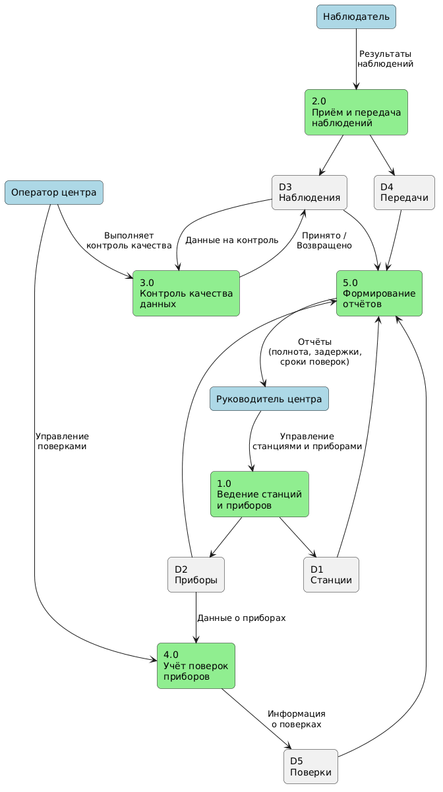

# DFD — Диаграмма потоков данных

Диаграмма потоков данных (DFD) описывает движение информации в системе сети метеорологических станций.  

## Внешние сущности

| Сущность | Роль в системе |
|---|---|
| **Наблюдатель** | Работает на станции: создаёт наблюдения и передаёт их в центр |
| **Оператор центра** | Выполняет контроль качества данных и учёт поверок приборов |
| **Руководитель центра** | Управляет станциями и приборами, получает сводные отчёты |

## Процессы

| № | Название | Что делает |
|---|---|---|
| **1.0** | Ведение станций и приборов | Регистрация, изменение и ведение сведений о станциях и приборах сети |
| **2.0** | Приём и передача наблюдений | Приём результатов наблюдений от станций, фиксация передач (в т.ч. задержанных) |
| **3.0** | Контроль качества данных | Проверка наблюдений (диапазоны, сравнение с соседними станциями), присвоение статуса |
| **4.0** | Учёт поверок приборов | Планирование и регистрация результатов поверок |
| **5.0** | Формирование отчётов | Сбор данных из всех хранилищ и формирование отчётов для руководителя |

## Хранилища данных

| Обозначение | Название | Содержимое |
|---|---|---|
| **D1** | Станции | Код, название, координаты, тип, статус станции |
| **D2** | Приборы | Тип, серийный номер, привязка к станции, статус, сроки поверки |
| **D3** | Наблюдения | Результаты измерений, время, тип (срочное/промежуточное), статус качества |
| **D4** | Передачи | Факт передачи наблюдения, время, признак задержки |
| **D5** | Поверки | Плановые и фактические даты поверок, результаты |

## Потоки данных

### От внешних сущностей

| Откуда | Куда | Поток |
|---|---|---|
| Наблюдатель | 2.0 | Результаты наблюдений |
| Оператор центра | 3.0 | Выполняет контроль качества |
| Оператор центра | 4.0 | Управление поверками |
| Руководитель центра | 1.0 | Управление станциями и приборами |

### Между процессами и хранилищами

| Откуда | Куда | Поток |
|---|---|---|
| 1.0 | D1 | Данные о станциях |
| 1.0 | D2 | Данные о приборах |
| 2.0 | D3 | Наблюдения |
| 2.0 | D4 | Сведения о передачах |
| D3 | 3.0 | Данные на контроль |
| 3.0 | D3 | Принято / Возвращено (статус качества) |
| D2 | 4.0 | Данные о приборах |
| 4.0 | D5 | Информация о поверках |
| D1, D2, D3, D4, D5 | 5.0 | Исходные данные для отчётов |
| 5.0 | Руководитель центра | Отчёты (полнота, задержки, сроки поверок) |

## Соответствие ролям и коду

| Роль | Процессы | Реализация в коде |
|---|---|---|
| Наблюдатель | 2.0 | `create_observation`, `transmit_observation` |
| Оператор центра | 3.0, 4.0 | `run_quality_control`, `schedule_verification`, `complete_verification` |
| Руководитель центра | 1.0, получение отчётов от 5.0 | `register_station`, `register_device`, `get_report` |
