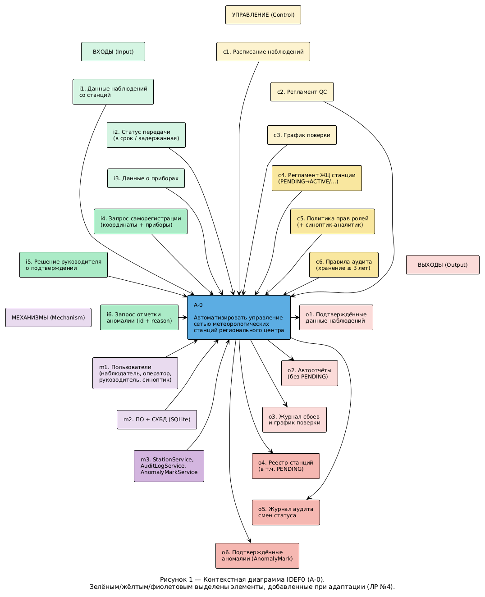
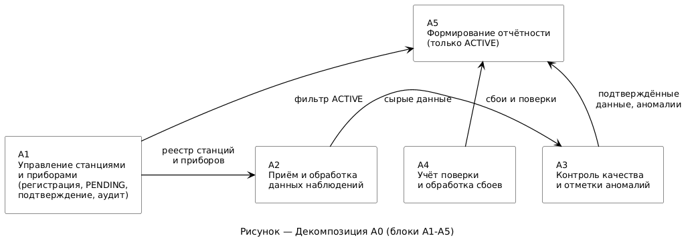

# Функциональная модель IDEF0

## 1. Контекстная диаграмма (А-0)

Единый блок: **«Автоматизировать управление сетью метеорологических станций
регионального центра»**.

### Спецификация стрелок (классификация по ICOM)

**а) Входы**

- данные наблюдений со станций — результаты измерений с указанием станции,
  прибора, параметра и времени;
- сведения о статусе передачи данных — отметка «передано вовремя» или
  «задержанная передача» (когда канал связи был недоступен);
- данные о приборах — тип, текущее состояние, сроки поверки;
- **(ЛР №4)** запрос саморегистрации станции — координаты, тип и перечень приборов;
- **(ЛР №4)** решение руководителя о подтверждении станции (перевод PENDING → ACTIVE);
- **(ЛР №4)** запрос отметки аномалии — идентификатор наблюдения и обоснование.

**б) Управление / Контроль**

- расписание наблюдений — срочные наблюдения каждые 3 часа, промежуточные —
  каждые 6 часов, для каждой станции указан перечень измеряемых параметров;
- регламент контроля качества данных — правила проверки диапазонов и
  сравнения показаний с соседними станциями для выявления выбросов;
- график поверки приборов — нормативные сроки поверки, по истечении которых
  прибор не может использоваться для наблюдений;
- **(ЛР №4)** регламент жизненного цикла станции (PENDING → ACTIVE / RESERVE / DECOMMISSIONED);
- **(ЛР №4)** политика разграничения прав ролей (в т.ч. синоптик-аналитик — только просмотр и отметки аномалий);
- **(ЛР №4)** правила ведения журнала аудита (фиксация инициатора, причины, статусов; хранение ≥ 3 лет).

**в) Механизмы**

- пользователи системы — наблюдатель на станции, руководитель регионального
  центра;
- **(ЛР №4)** синоптик-аналитик — просмотр данных всех станций, отметки аномалий, без права изменять наблюдения;
- программное обеспечение и СУБД сети станций — серверная часть, база
  данных наблюдений и каналы связи со станциями;
- **(ЛР №4)** сервисы StationService (register с pending, confirm), AuditLogService, AnomalyMarkService.

**г) Выходы**

- подтверждённые данные наблюдений — данные, прошедшие контроль качества;
- автоматически сформированные отчёты — полнота поступления данных по
  станциям и срокам, количество выбросов и задержанных передач, охват
  поверкой, плотность наблюдений по районам;
  **(ЛР №4)** данные станций со статусом PENDING в сводки не входят;
- журнал сбоев приборов и график поверки;
- **(ЛР №4)** реестр станций, включая ожидающие подтверждения (PENDING);
- **(ЛР №4)** журнал аудита смен статуса станций (фильтр по станции и периоду);
- **(ЛР №4)** перечень подтверждённых аномалий (AnomalyMark).

### Диаграмма

*Рисунок 1 — контекстная диаграмма IDEF0 (А-0).*

### Диаграмма (ЛР №4)

*Рисунок 2 — адаптированная контекстная диаграмма IDEF0 (А-0) после ЛР №4.
Зелёным / жёлтым / фиолетовым выделены элементы, добавленные при адаптации.*

---

## 2. Декомпозиция (А0 → А1…А5)

Основной процесс декомпозирован на пять подпроцессов:

1. **А1. Регистрация станций и приборов** — занесение новой станции и её
   приборов в реестр; исходные данные о приборах служат входом для этого
   блока.
   **(ЛР №4)** Также: саморегистрация со статусом PENDING, подтверждение
   руководителем, фиксация смен статуса в журнале аудита.
2. **А2. Приём и первичная обработка данных наблюдений** — приём измерений
   по расписанию, разбор статуса передачи (в срок / с задержкой).
   **(ЛР №4)** Данные от станций PENDING накапливаются, но не участвуют в сводках.
3. **А3. Контроль качества данных** — проверка диапазонов и сравнение с
   соседними станциями; работает под управлением регламента контроля
   качества.
   **(ЛР №4)** Синоптик-аналитик может отметить выброс как подтверждённую
   аномалию (AnomalyMark) без изменения исходного наблюдения.
4. **А4. Учёт поверки приборов и обработка сбоев** — отслеживание сроков
   поверки по графику, фиксация перехода станции на резервный прибор при
   сбое.
5. **А5. Формирование отчётности** — сборка данных из А3 и А4 в итоговые
   отчёты руководителя центра.
   **(ЛР №4)** В сводки включаются только станции со статусом ACTIVE;
   данные PENDING исключаются фильтром.

### Внешние стрелки (унаследованные с уровня А-0)

- данные о приборах → А1;
  **(ЛР №4)** запрос саморегистрации и решение о подтверждении → А1;
- данные наблюдений и статус передачи → А2;
- расписание наблюдений → А2; регламент контроля качества → А3; график
  поверки → А4;
  **(ЛР №4)** регламент ЖЦ станции и политика прав → А1; правила аудита → А1, А3;
- пользователи системы и ПО/СУБД поддерживают все пять блоков;
  **(ЛР №4)** в том числе роль синоптика-аналитика;
- подтверждённые данные наблюдений ← А3; журнал сбоев / график поверки ← А4;
  автоматически сформированные отчёты ← А5;
  **(ЛР №4)** реестр станций и журнал аудита ← А1; перечень аномалий ← А3;
  отчёты без PENDING ← А5.

### Внутренние интерконнекты

- А1 → А2 — реестр станций и приборов нужен, чтобы принимать данные именно
  от зарегистрированных источников;
- А2 → А3 — сырые данные наблюдений передаются на контроль качества;
- А3 → А5 — подтверждённые данные и сведения о выбросах идут в отчётность;
  **(ЛР №4)** также сведения об аномалиях;
- А4 → А5 — данные о сбоях и поверках идут в отчётность;
- **(ЛР №4)** А1 → А5 — признак статуса станции для фильтрации PENDING.

### Диаграмма

*Рисунок 3 — декомпозиция А0 на подпроцессы А1–А5.*

### Адаптированная диаграмма для ЛР №4

*Рисунок 4 — адаптированная декомпозиция А0 на подпроцессы А1–А5 (ЛР №4).
Новые функции саморегистрации, аудита и отметок аномалий встроены в блоки А1 и А3.*
