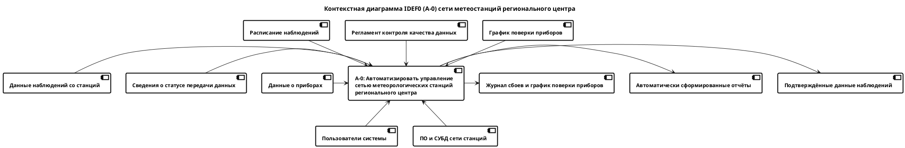
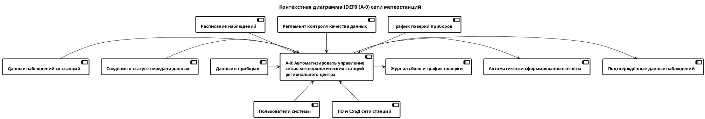

# Функциональная модель IDEF0

## 1. Контекстная диаграмма (А-0)

Единый блок: **«Автоматизировать управление сетью метеорологических станций
регионального центра»**.

### Спецификация стрелок (классификация по ICOM)

**а) Входы**

- данные наблюдений со станций — результаты измерений с указанием станции,
  прибора, параметра и времени;
- сведения о статусе передачи данных — отметка «передано вовремя» или
  «задержанная передача» (когда канал связи был недоступен);
- данные о приборах — тип, текущее состояние, сроки поверки.

**б) Управление / Контроль**

- расписание наблюдений — срочные наблюдения каждые 3 часа, промежуточные —
  каждые 6 часов, для каждой станции указан перечень измеряемых параметров;
- регламент контроля качества данных — правила проверки диапазонов и
  сравнения показаний с соседними станциями для выявления выбросов;
- график поверки приборов — нормативные сроки поверки, по истечении которых
  прибор не может использоваться для наблюдений.

**в) Механизмы**

- пользователи системы — наблюдатель на станции, руководитель регионального
  центра;
- программное обеспечение и СУБД сети станций — серверная часть, база
  данных наблюдений и каналы связи со станциями.

**г) Выходы**

- подтверждённые данные наблюдений — данные, прошедшие контроль качества;
- автоматически сформированные отчёты — полнота поступления данных по
  станциям и срокам, количество выбросов и задержанных передач, охват
  поверкой, плотность наблюдений по районам;
- журнал сбоев приборов и график поверки.

### Диаграмма

*Рисунок 1 — контекстная диаграмма IDEF0 (А-0).*

### Код диаграммы на языке PlantUML

*Рисунок 1а — код контекстной диаграммы на языке PlantUML.*

## 2. Декомпозиция (А0 → А1…А5)

Основной процесс декомпозирован на пять подпроцессов:

1. **А1. Регистрация станций и приборов** — занесение новой станции и её
   приборов в реестр; исходные данные о приборах служат входом для этого
   блока.
2. **А2. Приём и первичная обработка данных наблюдений** — приём измерений
   по расписанию, разбор статуса передачи (в срок / с задержкой).
3. **А3. Контроль качества данных** — проверка диапазонов и сравнение с
   соседними станциями; работает под управлением регламента контроля
   качества.
4. **А4. Учёт поверки приборов и обработка сбоев** — отслеживание сроков
   поверки по графику, фиксация перехода станции на резервный прибор при
   сбое.
5. **А5. Формирование отчётности** — сборка данных из А3 и А4 в итоговые
   отчёты руководителя центра.

### Внешние стрелки (унаследованные с уровня А-0)

- данные о приборах → А1;
- данные наблюдений и статус передачи → А2;
- расписание наблюдений → А2; регламент контроля качества → А3; график
  поверки → А4;
- пользователи системы и ПО/СУБД поддерживают все пять блоков;
- подтверждённые данные наблюдений ← А3; журнал сбоев / график поверки ← А4;
  автоматически сформированные отчёты ← А5.

### Внутренние интерконнекты

- А1 → А2 — реестр станций и приборов нужен, чтобы принимать данные именно
  от зарегистрированных источников;
- А2 → А3 — сырые данные наблюдений передаются на контроль качества;
- А3 → А5 — подтверждённые данные и сведения о выбросах идут в отчётность;
- А4 → А5 — данные о сбоях и поверках идут в отчётность.

### Диаграмма

*Рисунок 2 — декомпозиция А0 на подпроцессы А1–А5.*

## 3. То же самое на PlantUML

Как и в теоретической части задания, диаграммы можно оформить в разных
нотациях-языках — ниже тот же контекст и та же декомпозиция на PlantUML.

> GitHub не рендерит PlantUML прямо в файле (в отличие от Mermaid) — код
> нужно вставить в [онлайн-редактор PlantUML](https://www.plantuml.com/plantuml/uml/)
> или открыть через расширение PlantUML в VS Code / IntelliJ, чтобы увидеть
> картинку.

### Контекстная диаграмма (А-0)

*Рисунок 3 — код контекстной диаграммы на языке PlantUML.*

### Декомпозиция (А1–А5)

```plantuml
@startuml
skinparam BackgroundColor white
skinparam DefaultFontName Arial
skinparam DefaultFontSize 11
skinparam component {
  BackgroundColor white
  BorderColor black
  BorderThickness 2
  FontStyle bold
}
title Декомпозиция А0 на подпроцессы А1-А5

component "А1\nРегистрация станций и приборов" as A1
component "А2\nПриём и первичная обработка данных" as A2
component "А3\nКонтроль качества данных" as A3
component "А4\nУчёт поверки приборов и обработка сбоев" as A4
component "А5\nФормирование отчётности" as A5

' Внешние входы
[Данные о приборах] -right-> A1
[Данные наблюдений] -right-> A2
[Статус передачи данных] -right-> A2

' Управление
[Расписание наблюдений] -down-> A2
[Регламент контроля качества] -down-> A3
[График поверки приборов] -down-> A4

' Внутренние интерконнекты
A1 -right-> A2 : Реестр станций и приборов
A2 -right-> A3 : Данные наблюдений (сырые)
A3 -right-> A5 : Подтверждённые данные, выбросы
A4 -right-> A5 : Данные о сбоях и поверках

' Внешние выходы
A3 -right-> [Подтверждённые данные наблюдений]
A4 -right-> [Журнал сбоев / график поверки]
A5 -right-> [Автоматически сформированные отчёты]

' Механизмы
[Пользователи системы] -up-> A1
[Пользователи системы] -up-> A2
[Пользователи системы] -up-> A3
[Пользователи системы] -up-> A4
[Пользователи системы] -up-> A5
[ПО и СУБД сети станций] -up-> A2
[ПО и СУБД сети станций] -up-> A3
[ПО и СУБД сети станций] -up-> A5
@enduml
```

*Рисунок 4 — код диаграммы декомпозиции на языке PlantUML.*
