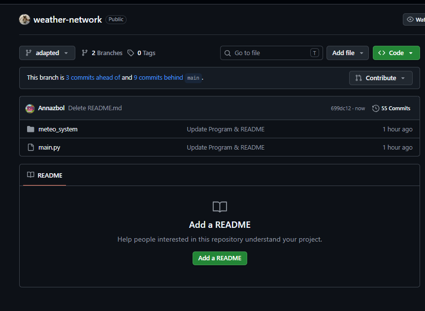

# IDEF1X — модель данных (3 лабораторная)

Модель описывает хранение данных сети метеорологических станций
регионального центра. Все сущности независимые: каждая имеет собственный
суррогатный первичный ключ. Связи неидентифицирующие (родительский ключ
не входит в первичный ключ потомка).

## Сущности

### Станция

Наблюдательный пункт сети. Независимая сущность.

| Атрибут | Ключ | Обязательность | Описание |
|---|---|---|---|
| ID_станции | PK | да | Идентификатор станции |
| Код | уникальный | да | Уникальный код (например, ST-001) |
| Название | | да | Наименование станции |
| Широта | | да | Географическая широта |
| Долгота | | да | Географическая долгота |
| Тип | | да | Наземная, аэрологическая, морская, автоматическая |
| Статус | | да | Активна / резерв / выведена |

### Прибор

Измерительное средство, закреплённое за станцией.

| Атрибут | Ключ | Обязательность | Описание |
|---|---|---|---|
| ID_прибора | PK | да | Идентификатор прибора |
| ID_станции | FK | да | Станция, за которой закреплён прибор |
| Название | | да | Наименование прибора |
| Тип | | да | Термометр, барометр и т. п. |
| Серийный_номер | уникальный | да | Заводской номер |
| Последняя_поверка | | нет | Дата последней поверки |
| Следующая_поверка | | нет | Плановая дата следующей поверки |
| Статус | | да | Исправен / резервный / неисправен |

### Наблюдение

Результат одного срока наблюдений на станции.

| Атрибут | Ключ | Обязательность | Описание |
|---|---|---|---|
| ID_наблюдения | PK | да | Идентификатор наблюдения |
| ID_станции | FK | да | Станция, выполнившая наблюдение |
| Время_наблюдения | | да | Дата и время срока |
| Вид | | да | Срочное (3 часа) или промежуточное (6 часов) |
| Параметры | | да | Измеренные значения (температура, давление, влажность и др.) |
| Статус | | да | Создано / передано / на перепроверке / принято |

### Передача

Факт отправки наблюдения в региональный центр.

| Атрибут | Ключ | Обязательность | Описание |
|---|---|---|---|
| ID_передачи | PK | да | Идентификатор передачи |
| ID_наблюдения | FK | да | Переданное наблюдение |
| Время_передачи | | да | Фактическое время отправки |
| Задержана | | да | Признак: фактическое время позже срока наблюдения |

### Поверка

Плановая или выполненная поверка прибора.

| Атрибут | Ключ | Обязательность | Описание |
|---|---|---|---|
| ID_поверки | PK | да | Идентификатор поверки |
| ID_прибора | FK | да | Поверяемый прибор |
| Плановая_дата | | да | Назначенная дата поверки |
| Статус | | да | Запланировано / выполнено / просрочено |

## Связи

| Родитель | Потомок | Кардинальность | Тип связи | Смысл |
|---|---|---|---|---|
| Станция | Прибор | 1 : M | неидентифицирующая | На станции много приборов |
| Станция | Наблюдение | 1 : M | неидентифицирующая | Станция выполняет много наблюдений |
| Прибор | Поверка | 1 : M | неидентифицирующая | У прибора несколько поверок |
| Наблюдение | Передача | 1 : M | неидентифицирующая | Наблюдение может передаваться повторно |

Все связи обязательны со стороны потомка: прибор, наблюдение, передача
и поверка не существуют без родителя.

## Правила целостности

- Код станции уникален во всей сети.
- Серийный номер прибора уникален.
- Прибор обязан ссылаться на существующую станцию.
- Наблюдение обязано ссылаться на существующую станцию.
- Передача обязана ссылаться на существующее наблюдение.
- Поверка обязана ссылаться на существующий прибор.
- Рассчитываемые величины (полнота данных, плотность наблюдений)
  в модель не входят: они получаются из дат и координат.

# IDEF1X — модель данных (обновлённая для 4 лабораторной)

Модель расширена под новые требования: саморегистрация станций,
отметки подтверждённых аномалий и журнал аудита. Все сущности по-прежнему
независимые (суррогатный PK), связи — неидентифицирующие.

## Изменения относительно модели ЛР №3

| Что изменилось | Детали |
|---|---|
| Статус станции | Добавлено значение **«ожидает подтверждения»** (PENDING) |
| Новая сущность **Отметка аномалии** | Отдельная запись; исходное наблюдение не изменяется |
| Новая сущность **Журнал аудита** | Фиксация смен статуса станции (кто, когда, почему) |

## Сущности (обновлённые и новые)

### Станция *(обновлена)*

| Атрибут | Ключ | Обязательность | Описание |
|---|---|---|---|
| ID_станции | PK | да | Идентификатор станции |
| Код | уникальный | да | Уникальный код (например, ST-001) |
| Название | | да | Наименование станции |
| Широта | | да | Географическая широта |
| Долгота | | да | Географическая долгота |
| Тип | | да | Наземная, аэрологическая, морская, автоматическая |
| Статус | | да | **Ожидает подтверждения** / активна / резерв / выведена |

### Прибор

Без изменений относительно ЛР №3.

### Наблюдение

Без изменений относительно ЛР №3. Исходные данные **не изменяются**
при отметке аномалии синоптиком-аналитиком.

### Передача

Без изменений относительно ЛР №3.

### Поверка

Без изменений относительно ЛР №3.

### Отметка аномалии *(новая)*

Отметка синоптика-аналитика: выброс признан подтверждённой аномалией
(не ошибкой измерения). История отметок хранится отдельно от наблюдения.

| Атрибут | Ключ | Обязательность | Описание |
|---|---|---|---|
| ID_отметки | PK | да | Идентификатор отметки |
| ID_наблюдения | FK | да | Наблюдение, к которому относится отметка |
| ID_автора | | да | Идентификатор синоптика-аналитика |
| Имя_автора | | да | ФИО / имя автора отметки |
| Обоснование | | да | Текстовое обоснование (обязательно) |
| Время_создания | | да | Дата и время отметки |

### Журнал аудита *(новая)*

Запись о смене статуса станции. Хранение не менее 3 лет;
поддержка фильтрации по станции и периоду.

| Атрибут | Ключ | Обязательность | Описание |
|---|---|---|---|
| ID_записи | PK | да | Идентификатор записи журнала |
| ID_станции | FK | да | Станция, у которой сменился статус |
| Старый_статус | | нет | Предыдущий статус (пусто при первой регистрации) |
| Новый_статус | | да | Установленный статус |
| Инициатор | | да | Кто выполнил изменение |
| Причина | | да | Обоснование смены статуса |
| Время_создания | | да | Дата и время записи |

## Связи (обновлённые)

| Родитель | Потомок | Кардинальность | Тип связи | Смысл |
|---|---|---|---|---|
| Станция | Прибор | 1 : M | неидентифицирующая | На станции много приборов |
| Станция | Наблюдение | 1 : M | неидентифицирующая | Станция выполняет много наблюдений |
| Станция | Журнал аудита | 1 : M | неидентифицирующая | Смены статуса станции |
| Прибор | Поверка | 1 : M | неидентифицирующая | У прибора несколько поверок |
| Наблюдение | Передача | 1 : M | неидентифицирующая | Наблюдение может передаваться повторно |
| Наблюдение | Отметка аномалии | 1 : M | неидентифицирующая | У наблюдения может быть несколько отметок |

## Правила целостности (дополнения)

- Код станции уникален во всей сети.
- Серийный номер прибора уникален.
- Прибор, наблюдение, запись аудита обязаны ссылаться на существующую станцию.
- Отметка аномалии и передача обязаны ссылаться на существующее наблюдение.
- Поверка обязана ссылаться на существующий прибор.
- Статус станции — только из допустимого перечня (включая «ожидает подтверждения»).
- Обоснование отметки аномалии и причина записи аудита не могут быть пустыми.
- Данные станций со статусом «ожидает подтверждения» накапливаются,
  но не участвуют в сводных отчётах.
