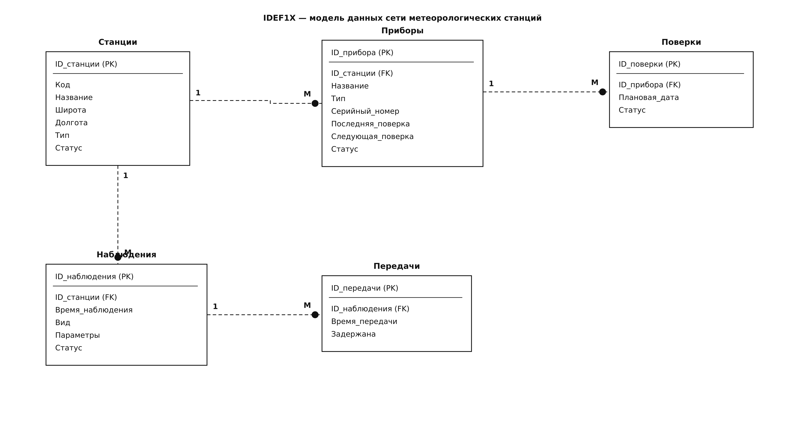

# IDEF1X — модель данных

Модель описывает хранение данных сети метеорологических станций
регионального центра. Все сущности независимые: каждая имеет собственный
суррогатный первичный ключ. Связи неидентифицирующие (родительский ключ
не входит в первичный ключ потомка).

## Сущности

### Станция

Наблюдательный пункт сети. Независимая сущность.

| Атрибут | Ключ | Обязательность | Описание |
|---|---|---|---|
| ID_станции | PK | да | Идентификатор станции |
| Код | уникальный | да | Уникальный код (например, ST-001) |
| Название | | да | Наименование станции |
| Широта | | да | Географическая широта |
| Долгота | | да | Географическая долгота |
| Тип | | да | Наземная, аэрологическая, морская, автоматическая |
| Статус | | да | Активна / резерв / выведена |

### Прибор

Измерительное средство, закреплённое за станцией.

| Атрибут | Ключ | Обязательность | Описание |
|---|---|---|---|
| ID_прибора | PK | да | Идентификатор прибора |
| ID_станции | FK | да | Станция, за которой закреплён прибор |
| Название | | да | Наименование прибора |
| Тип | | да | Термометр, барометр и т. п. |
| Серийный_номер | уникальный | да | Заводской номер |
| Последняя_поверка | | нет | Дата последней поверки |
| Следующая_поверка | | нет | Плановая дата следующей поверки |
| Статус | | да | Исправен / резервный / неисправен |

### Наблюдение

Результат одного срока наблюдений на станции.

| Атрибут | Ключ | Обязательность | Описание |
|---|---|---|---|
| ID_наблюдения | PK | да | Идентификатор наблюдения |
| ID_станции | FK | да | Станция, выполнившая наблюдение |
| Время_наблюдения | | да | Дата и время срока |
| Вид | | да | Срочное (3 часа) или промежуточное (6 часов) |
| Параметры | | да | Измеренные значения (температура, давление, влажность и др.) |
| Статус | | да | Создано / передано / на перепроверке / принято |

### Передача

Факт отправки наблюдения в региональный центр.

| Атрибут | Ключ | Обязательность | Описание |
|---|---|---|---|
| ID_передачи | PK | да | Идентификатор передачи |
| ID_наблюдения | FK | да | Переданное наблюдение |
| Время_передачи | | да | Фактическое время отправки |
| Задержана | | да | Признак: фактическое время позже срока наблюдения |

### Поверка

Плановая или выполненная поверка прибора.

| Атрибут | Ключ | Обязательность | Описание |
|---|---|---|---|
| ID_поверки | PK | да | Идентификатор поверки |
| ID_прибора | FK | да | Поверяемый прибор |
| Плановая_дата | | да | Назначенная дата поверки |
| Статус | | да | Запланировано / выполнено / просрочено |

## Связи

| Родитель | Потомок | Кардинальность | Тип связи | Смысл |
|---|---|---|---|---|
| Станция | Прибор | 1 : M | неидентифицирующая | На станции много приборов |
| Станция | Наблюдение | 1 : M | неидентифицирующая | Станция выполняет много наблюдений |
| Прибор | Поверка | 1 : M | неидентифицирующая | У прибора несколько поверок |
| Наблюдение | Передача | 1 : M | неидентифицирующая | Наблюдение может передаваться повторно |

Все связи обязательны со стороны потомка: прибор, наблюдение, передача
и поверка не существуют без родителя.

## Правила целостности

- Код станции уникален во всей сети.
- Серийный номер прибора уникален.
- Прибор обязан ссылаться на существующую станцию.
- Наблюдение обязано ссылаться на существующую станцию.
- Передача обязана ссылаться на существующее наблюдение.
- Поверка обязана ссылаться на существующий прибор.
- Рассчитываемые величины (полнота данных, плотность наблюдений)
  в модель не входят: они получаются из дат и координат.
