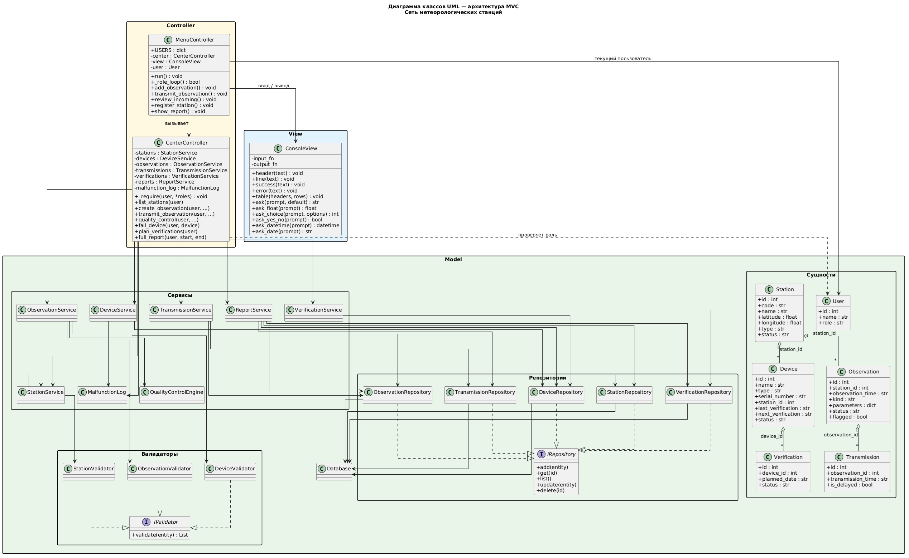

# Архитектура: разделение на Model / View / Controller

## Три слоя

**Model** — сущности предметной области и вся логика работы с данными
(валидация, расчёты, хранение, правила переходов статусов). Сюда входят:

- сущности: `Station`, `Device`, `Observation`, `Transmission`,
  `Verification`, `User`;
- сервисы: `StationService`, `DeviceService`, `ObservationService`,
  `TransmissionService`, `VerificationService`, `ReportService`;
- вспомогательные компоненты: `QualityControlEngine`, `ObservationSchedule`,
  `VerificationPolicy`, `MalfunctionLog`;
- доступ к данным: репозитории и `Database`;
- валидаторы: `StationValidator`, `DeviceValidator`, `ObservationValidator`.

Именно в Model выполняются проверки. Например, валидаторы проверяют поля
станций, приборов и наблюдений; `QualityControlEngine` — диапазоны и
отклонение от соседних станций; `ObservationService` — активность станции,
уникальность срока и наличие исправного прибора с действующей поверкой;
`TransmissionService` выставляет признак задержанной передачи.

**View** — пользовательское представление. Реализован один класс
`ConsoleView`: заголовки, таблицы, сообщения об успехе и ошибках, ввод
строк, чисел, дат и выбор из списка. View не обращается к БД и не содержит
предметных правил — только разбор формата ввода и отображение.

**Controller** — связующее звено между вводом пользователя и Model:

- `MenuController` — выбор роли, меню действий, запрос данных через View,
  вызов `CenterController`, вывод результата;
- `CenterController` — единая точка входа к операциям Model с проверкой
  роли (`_require`); бизнес-правил и валидации в нём нет.

Controller не проверяет данные сам: при `ValueError` / `PermissionError`
из Model показывает сообщение через `view.error()`.

## Взаимодействие слоёв и интерфейсы

Поток вызовов:

**View → MenuController → CenterController → Service → Repository → БД**,
затем результат обратно во View.

View никогда не обращается к Model напрямую и не решает, корректны ли
данные с точки зрения предметной области.

Чтобы сервисы не зависели от конкретной реализации хранения и проверки,
введены два интерфейса:

- **`IRepository`** (`add`, `get`, `list`, `update`, `delete`) — реализуется
  `StationRepository`, `DeviceRepository`, `ObservationRepository` и др.;
  детали SQLite скрыты внутри репозиториев;
- **`IValidator`** (`validate(entity) → list[str]`) — реализуется
  `StationValidator`, `DeviceValidator`, `ObservationValidator`; сервисы
  вызывают валидаторы перед сохранением.

Сборка зависимостей (репозитории → сервисы → контроллеры) выполняется в
`bootstrap.build()` — composition root приложения.

## Диаграмма классов

Пакеты `Model`, `View` и `Controller` на диаграмме подписаны и разделены
цветом фона. На диаграмме отражены фактические классы реализации:
`MenuController`, `CenterController`, `ConsoleView`, сервисы, репозитории,
валидаторы и интерфейсы `IRepository` / `IValidator`.
