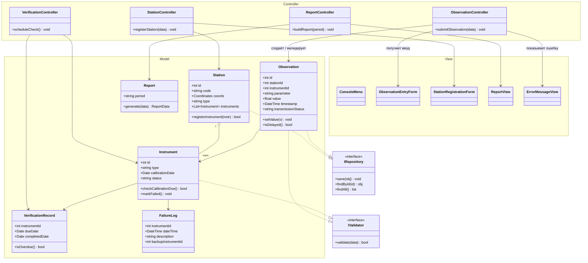

# Архитектура: разделение на Model / View / Controller

## Три слоя

**Model** — классы предметной области и вся логика работы с данными
(валидация, расчёты, хранение, правила переходов между статусами):

- `Station` — станция: код, координаты, тип, список приборов; проверяет
  совместимость прибора при регистрации;
- `Instrument` — прибор: тип, дата последней поверки, состояние; сам решает,
  просрочена ли поверка (`checkCalibrationDue`), и переводит себя в статус
  «неисправен»;
- `Observation` — наблюдение: станция, прибор, параметр, значение, время,
  статус передачи; **проверяет диапазон значения при установке**
  (`setValue`) и определяет, было ли наблюдение задержанным;
- `VerificationRecord` — запись о поверке прибора, знает, просрочена ли она;
- `FailureLog` — запись о сбое прибора и переходе на резервный;
- `Report` — формирует отчётные данные по накопленной статистике.

**View** — пользовательское представление:

- `ConsoleMenu` — консольное меню наблюдателя и руководителя центра;
- `ObservationEntryForm` — форма ввода результата измерения;
- `StationRegistrationForm` — форма регистрации станции/прибора;
- `ReportView` — вывод сформированных отчётов;
- `ErrorMessageView` — вывод сообщений об ошибках (в том числе ошибок
  валидации, полученных от Model через Controller).

**Controller** — связующее звено, принимает действия пользователя, вызывает
методы Model и обновляет View:

- `ObservationController.submitObservation(data)` — получает данные из
  `ObservationEntryForm`, создаёт `Observation` и передаёт значение в
  `setValue`; если Model выбрасывает ошибку валидации — вызывает
  `ErrorMessageView`, если нет — сохраняет через репозиторий и обновляет
  View подтверждением;
- `StationController.registerStation(data)` — регистрация станции/прибора;
- `VerificationController.scheduleCheck()` — формирование графика поверки;
- `ReportController.buildReport(period)` — запрашивает у `Report` данные за
  период и передаёт их в `ReportView`.

Controller **не содержит проверок бизнес-правил** — он только маршрутизирует
данные между View и Model и решает, какой View показать в ответ.

## Взаимодействие слоёв и интерфейсы

Чтобы Model не зависел от конкретного способа хранения и от конкретной
реализации проверки, введены два интерфейса:

- **`IRepository`** (`save`, `findById`, `findAll`) — реализуется классами
  хранения для `Station` и `Observation`; Controller работает с хранилищем
  только через этот интерфейс, поэтому реализацию (файлы JSON, SQLite и
  т. п.) можно поменять, не трогая Controller и Model;
- **`IValidator`** (`validate(data)`) — реализуется самими доменными
  классами (`Observation`, `Instrument`), которые проверяют собственные
  данные при изменении состояния.

Поток вызовов: `View → Controller → Model (через IValidator/IRepository) →
Controller → View`. View никогда не обращается к Model напрямую и не
принимает решений о корректности данных — эти решения принимает только
Model.

## Диаграмма классов (Mermaid)

*Пакеты `Model`, `View`, `Controller` соответствуют требуемым подписям
разделения на диаграмме.*
