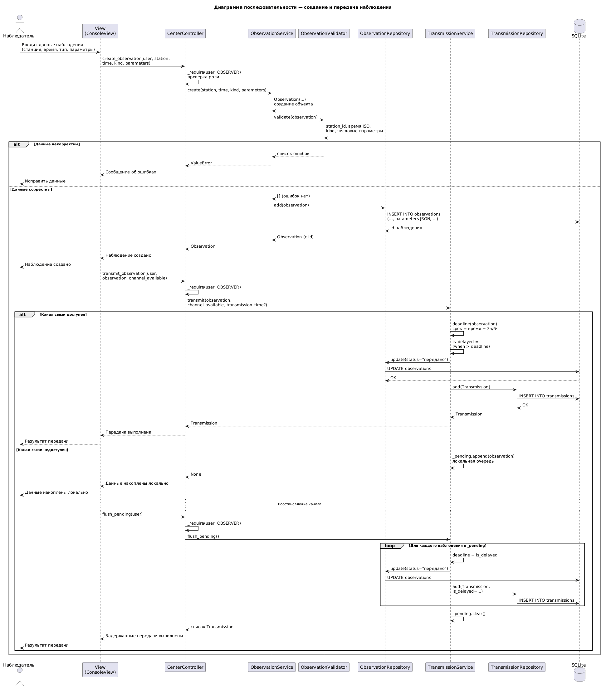

# Диаграмма последовательности: создание и передача наблюдения

Диаграмма описывает ключевой сценарий работы сети станций: наблюдатель
фиксирует срок наблюдений и передаёт результаты в региональный центр.
На оси времени показаны роли и объекты системы, порядок сообщений
и два разветвления: проверка введённых данных и состояние канала связи.

## Объекты на диаграмме

- **Наблюдатель** — внешний актор, инициирует сценарий.
- **Представление** — принимает ввод и показывает результат.
- **Контроллер** — принимает действие пользователя и проверяет права роли.
- **Служба наблюдений** — создаёт запись наблюдения.
- **Валидатор** — проверяет корректность введённых данных.
- **Хранилище наблюдений** — сохраняет и обновляет наблюдение.
- **Служба передачи** — отправляет данные в центр или накапливает их локально.
- **Хранилище передач** — фиксирует факт передачи и признак задержки.
- **База данных** — постоянное хранение записей.

## Основной поток

1. Наблюдатель вводит данные наблюдения: станцию, время срока, тип
   (срочное или промежуточное) и измеренные параметры.
2. Представление передаёт запрос контроллеру.
3. Контроллер проверяет, что действие доступно роли «наблюдатель».
4. Служба наблюдений формирует объект наблюдения и передаёт его валидатору.
5. Валидатор проверяет обязательность станции, корректность времени,
   допустимость типа и то, что параметры заданы числом.

## Ветвь: данные некорректны

Если проверка не пройдена, валидатор возвращает перечень ошибок.
Контроллер передаёт сообщение в представление, наблюдатель исправляет
ввод. Сценарий на этом шаге завершается без сохранения.

## Ветвь: данные корректны

1. Наблюдение сохраняется в базе, объекту присваивается идентификатор.
2. Представление сообщает, что наблюдение создано, и инициирует передачу
   с указанием доступности канала связи.

### Канал связи доступен

Служба передачи сравнивает фактическое время отправки со сроком
наблюдения (3 часа для срочного, 6 часов для промежуточного).
Если фактическое время позже срока, передача помечается как задержанная.
Статус наблюдения меняется на «передано», в хранилище передач создаётся
запись. Наблюдатель получает подтверждение.

### Канал связи недоступен

Наблюдение помещается в локальную очередь и не отправляется в центр.
Представление сообщает, что данные накоплены на станции.

После восстановления канала наблюдатель повторяет отправку. Для каждого
накопленного наблюдения снова определяется задержка, статус меняется
на «передано», создаётся запись передачи. Очередь очищается.
Наблюдатель получает итог по всем отложенным передачам.

## Что фиксирует диаграмма

- Разделение ответственности: представление не проверяет данные,
  контроллер проверяет только права, предметные правила выполняются
  службами и валидатором.
- Два независимых условия: корректность ввода и доступность канала.
- Правило задержки передачи по сроку наблюдения.
- Накопление данных при обрыве связи и последующую досылку.
