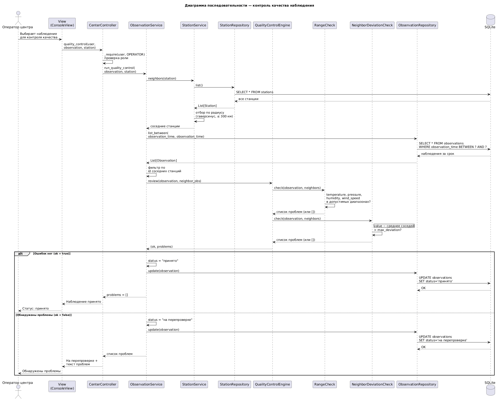

# Диаграмма последовательности: контроль качества наблюдения

Диаграмма описывает сценарий проверки поступившего наблюдения оператором
центра. На оси времени показаны проверка прав, подбор соседних станций,
сравнение параметров, проверка диапазонов и смена статуса наблюдения.

## Объекты на диаграмме

- **Оператор центра** — внешний актор, запускает контроль качества.
- **Представление** — принимает выбор наблюдения и показывает итог.
- **Контроллер** — принимает действие и проверяет права роли.
- **Служба наблюдений** — координирует проверку и меняет статус.
- **Служба станций** — подбирает соседние станции.
- **Хранилище станций** — выдаёт перечень станций сети.
- **Движок контроля качества** — объединяет результаты отдельных проверок.
- **Проверка диапазонов** — сравнивает значения с допустимыми пределами.
- **Проверка отклонения от соседей** — сравнивает значение со средним
  по соседним станциям за тот же срок.
- **Хранилище наблюдений** — выдаёт наблюдения и сохраняет новый статус.
- **База данных** — постоянное хранение станций и наблюдений.

## Основной поток

1. Оператор выбирает наблюдение для контроля.
2. Представление передаёт запрос контроллеру вместе с наблюдением
   и станцией, на которой оно выполнено.
3. Контроллер проверяет, что действие доступно роли «оператор центра».
4. Служба наблюдений запрашивает соседние станции: из полного перечня
   отбираются станции в радиусе 300 км (расстояние по координатам).
5. За тот же срок наблюдения выбираются результаты соседних станций.
6. Движок контроля качества последовательно выполняет две проверки.

## Проверки качества

**Проверка диапазонов.** Каждый измеренный параметр сравнивается
с допустимым интервалом:

| Параметр | Допустимый диапазон |
|---|---|
| Температура | −60 … 50 |
| Давление | 900 … 1100 |
| Влажность | 0 … 100 |
| Скорость ветра | 0 … 60 |

Значение вне интервала считается проблемой.

**Проверка отклонения от соседей.** Для каждого параметра считается
среднее по соседним станциям. Если абсолютное отклонение превышает
порог, значение считается выбросом.

Результаты обеих проверок собираются в общий список проблем.

## Ветвь: ошибок нет

Наблюдение получает статус «принято». Изменение сохраняется.
Оператор видит подтверждение, что данные прошли контроль.

## Ветвь: обнаружены проблемы

Наблюдение получает статус «на перепроверке». Изменение сохраняется.
Оператор видит перечень проблем и указание вернуть данные на станцию.

## Что фиксирует диаграмма

- Контроль качества выполняет оператор центра, а не наблюдатель.
- Предметные правила (диапазоны и сравнение с соседями) отделены
  от проверки прав и от представления.
- Статус наблюдения меняется только после завершения всех проверок.
- Возврат на перепроверку — штатный исход сценария, а не аварийный сбой.
