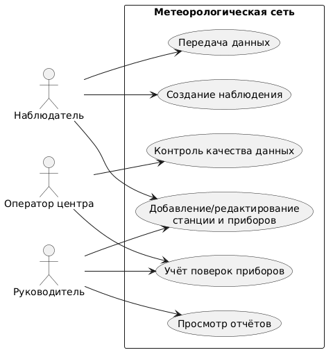
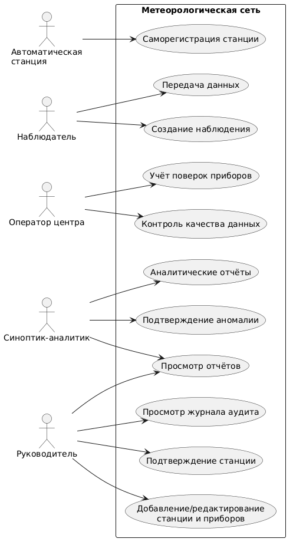

# Use Case — Диаграмма вариантов использования (3 лабораторная)

Система: **Метеорологическая сеть**.

## Актёры

| Актёр | Описание |
|---|---|
| **Наблюдатель** | Сотрудник на станции. Создаёт наблюдения и передаёт данные в центр |
| **Оператор центра** | Сотрудник центра. Выполняет контроль качества и учёт поверок приборов |
| **Руководитель** | Руководитель центра. Управляет станциями и приборами, просматривает отчёты |

## Варианты использования

| Use Case | Описание | Актёр |
|---|---|---|
| **Создание наблюдения** | Фиксация результатов измерений (срочные / промежуточные) | Наблюдатель |
| **Передача данных** | Отправка наблюдений в центр (в т.ч. задержанная передача) | Наблюдатель |
| **Контроль качества данных** | Проверка наблюдений (диапазоны, сравнение с соседями), присвоение статуса | Оператор центра |
| **Добавление/редактирование станции и приборов** | Регистрация и изменение сведений о станциях и приборах | Руководитель |
| **Учёт поверок приборов** | Планирование и регистрация результатов поверок | Оператор центра |
| **Просмотр отчётов** | Получение сводных отчётов (полнота, задержки, сроки поверок) | Руководитель |

# Use Case — Диаграмма вариантов использования (обновлённая для 4 лабораторной)

## Актёры

| Актёр | Описание |
|---|---|
| **Автоматическая станция** | Внешняя станция. При первом подключении сама регистрируется и передаёт координаты и перечень приборов |
| **Наблюдатель** | Сотрудник на станции. Создаёт наблюдения и передаёт данные в центр |
| **Оператор центра** | Выполняет контроль качества данных и учёт поверок приборов |
| **Синоптик-аналитик** | Просматривает данные всех станций, отмечает подтверждённые аномалии, формирует аналитические отчёты. Исходные наблюдения не изменяет |
| **Руководитель** | Подтверждает новые станции, управляет станциями и приборами, просматривает отчёты и журнал аудита |

## Варианты использования

| Use Case | Описание | Актёр |
|---|---|---|
| **Саморегистрация станции** | Автоматическая регистрация при первом подключении (координаты, приборы). Статус «ожидает подтверждения» | Автоматическая станция |
| **Подтверждение станции** | Включение станции в сеть. До подтверждения данные копятся, но не входят в сводки | Руководитель |
| **Добавление/редактирование станции и приборов** | Ручная регистрация и изменение станций и приборов; смена статуса пишется в журнал аудита | Руководитель |
| **Создание наблюдения** | Фиксация результатов измерений (срочные / промежуточные) | Наблюдатель |
| **Передача данных** | Отправка наблюдений в центр (в т.ч. задержанная передача) | Наблюдатель |
| **Контроль качества данных** | Проверка наблюдений (диапазоны, сравнение с соседями), присвоение статуса | Оператор центра |
| **Подтверждение аномалии** | Отметка выброса как «подтверждённая аномалия» с автором и обоснованием | Синоптик-аналитик |
| **Учёт поверок приборов** | Планирование и регистрация результатов поверок | Оператор центра |
| **Просмотр отчётов** | Сводные отчёты (полнота, задержки, сроки поверок) | Руководитель, Синоптик-аналитик |
| **Аналитические отчёты** | Специализированные аналитические отчёты | Синоптик-аналитик |
| **Просмотр журнала аудита** | Журнал смен статуса станций с фильтром по станции и периоду | Руководитель |
